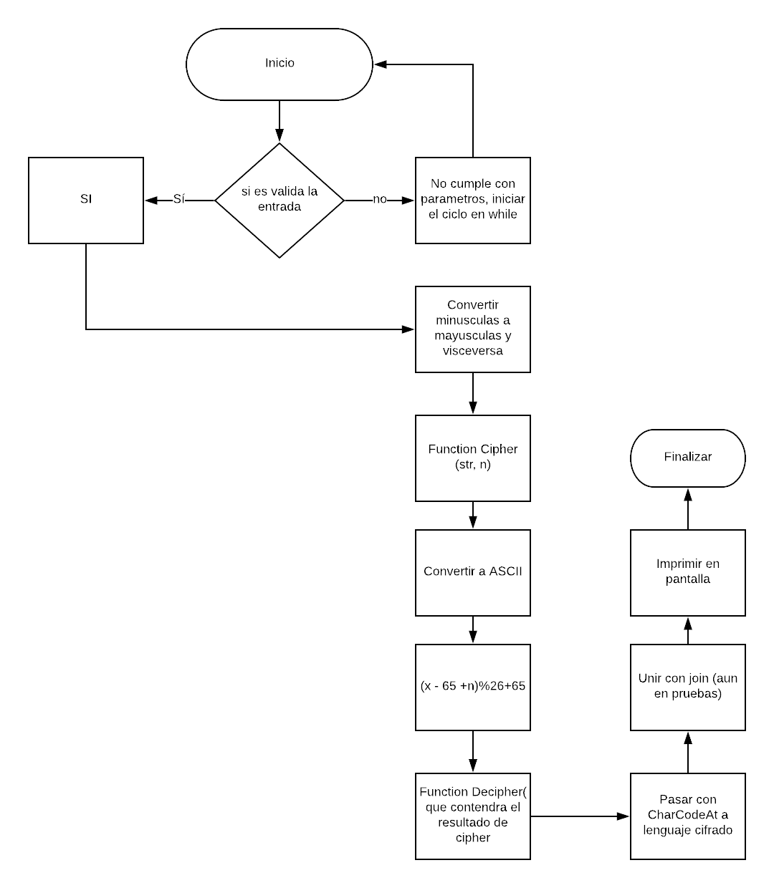

# Cifrado Cesar

##Descripcion
Crea una web que pida, por medio de un prompt(), una frase al usuario y devuelva el mismo mensaje encriptado según el algoritmo de Cifrado César con el parámetro de desplazamiento de 33 espacios hacia la derecha

Por ejemplo:

Texto original: ABCDEFGHIJKLMNOPQRSTUVWXYZ
Texto codificado: HIJKLMNOPQRSTUVWXYZABCDEFG

###Consideraciones Específicas

Tu programa debe ser capaz de cifrar y descifrar tanto letras mayúsculas como minúsculas. La fórmula para descifrar es: __(x - 65 +n)%26+65__

Tu código debe estar compuesto por 2 funciones con los siguientes nombres: cipher y decipher

El usuario no debe poder ingresar un campo vacío o que contenga números

## Pseudocodigo

-[] Crea prompt para que el usuario agregue la palabra a codificar
-[] Si no contesta, usar un ciclo para seguir preguntando hasta que sea valido.
-[] Si es valido, pasarlo por funcion que convierta a minusculas o minusculas
-[] Crear funcion cipher que contendra lo que codificara (str) y el (n) valor fijo
-[] Iterar en el string
-[] Usar charCodeAt para complementar  la iteracion y vaya obteniendo los indices ASCII
-[] Pasar estos elementos por medio de la formula __(x - 65 +n)%26+65__
-[] Crear una variable que contenga este mismo resultado.
-[] Crear una funcion llamada Decipher(resultado de cipher)
-[] Iterar entre cipher
-[] pasar la respuesta entre el metodo str.fromCharCode
-[] Imprimir en pantalla o por alert.

## Funcionalidad.
-[] prompt('string')
-[] function cipher(st, n);
-[] validacion de string
-[] for (var i =0 ; i <= string.length ; i++ )
-[] var string2  = input.charCodeAt(i); // esta debera guardar los resultados
-[] var Decipher2 = (string - 65 + n(<- numero fijo en este caso 33))%26 + 65
-[] for (var e = 0; e  <= string2.length; e++);
-[] var resultDecip= resultDecipher.fromCharCode(e);
-[] var array = resultDecipher.push()
-[] var result = array.join('')

##Diagrama de Flujo

